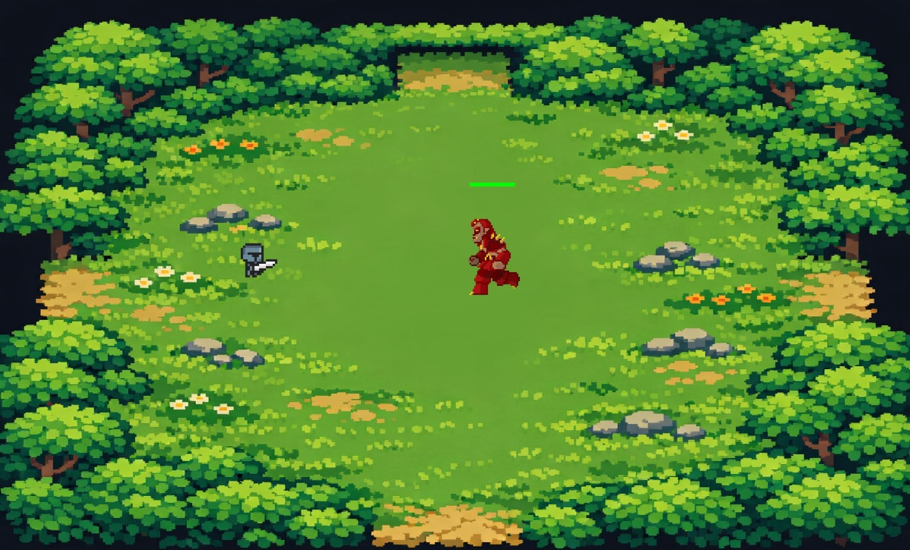

# Dungeon Python game

A simple game using https://github.com/pygame-community/pygame-ce



## Setup Instructions

### 1. Create a Virtual Environment

**macOS/Linux:**
```bash
python3 -m venv venv
source venv/bin/activate
```

**Windows:**
```bash
python -m venv venv
venv\Scripts\activate
```

### 2. Install Dependencies

```bash
pip install -r requirements.txt
```

### 3. Run the Game

```bash
python main.py
```

### 4. Deactivate Virtual Environment

When you're done working on the project:
```bash
deactivate
```

## Project Structure

```
pygame-dungeon/
├── assets/          # Game assets
│   ├── images/      # Sprites, backgrounds, etc.
│   ├── sounds/      # Sound effects and music
│   └── fonts/       # Custom fonts
├── src/             # Game source code
│   ├── __init__.py
│   └── game.py      # Main game class
├── main.py          # Entry point
├── requirements.txt # Python dependencies
└── README.md        # This file
```

## Requirements

- Python 3.8 or higher (including Python 3.13+)
- Pygame-CE (Community Edition) 2.5.0+

# Credits

* Knight: https://pixelfelix.itch.io/knight-anim-set
* Enemy: https://binary-80.itch.io/dragonlord
* Background: "pixelart 2d top-down dungeon game background. very simple with just outer walls with openings" AI prompt
